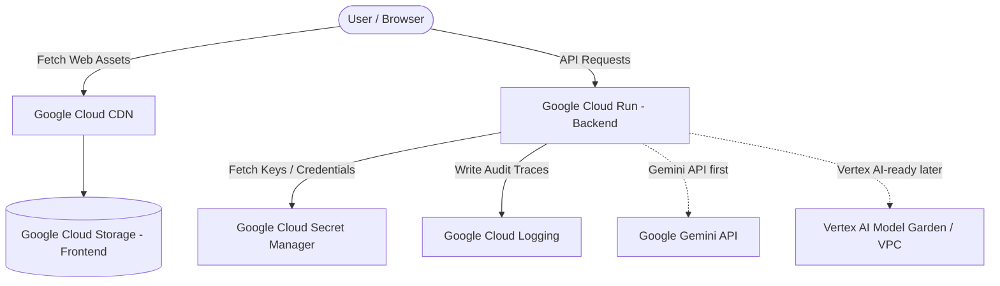

# Google Cloud Architecture

This document details the target Google Cloud architecture for the production deployment of the NEES Core Engine.

## Target Google Cloud Architecture Diagram

## Component Architecture & Services

### 1. Frontend Hosting (Google Cloud Storage + Cloud CDN)
* **Description**: The static React application is hosted in a public, read-only Cloud Storage bucket.
* **Benefit**: Google Cloud CDN caches assets globally, minimizing latencies and reducing hosting costs.

### 2. Backend Compute (Google Cloud Run)
* **Description**: The FastAPI backend is packaged inside a Docker container and deployed to Cloud Run.
* **Benefit**: Serverless compute automatically scales down to zero when idle, minimizing costs during testing, and handles spikes effortlessly.

### 3. Secure Configuration (Google Secret Manager & Cloud KMS)
* **Description**: Backend environmental configuration variables (such as `GEMINI_API_KEY`) are stored in Secret Manager and encrypted with a customer-managed key in Cloud KMS.
* **Benefit**: No secrets are stored in code or environments, meeting strict compliance and audit requirements.

### 4. LLM Providers (Gemini API & Vertex AI)
* **Gemini API first**: For initial developer-centric features, the backend utilizes the Google Gemini API to retrieve candidate response data.
* **Vertex AI-ready later**: The codebase is architected with a decoupled model client, allowing enterprise deployments to migrate seamlessly to dedicated Vertex AI endpoints for model security and private VPC access.

### 5. Audit Logging (Google Cloud Logging)
* **Description**: Governance traces and policy decisions are output as structured logs that get ingested into Cloud Logging.
* **Benefit**: Allows real-time security alerts and forensic audits without maintaining database instances.
